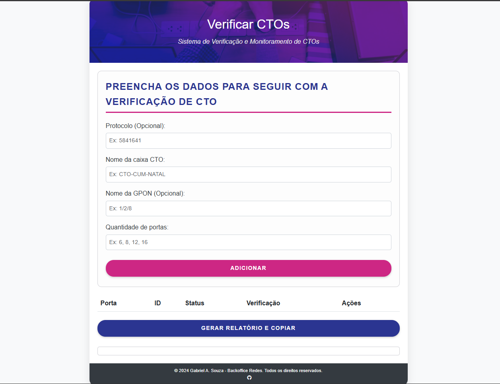

# Verificar CTOs

Este projeto é um sistema web para gerenciamento e verificação de Centrais de Terminais Ópticos (CTOs) em redes GPON, desenvolvido para auxiliar técnicos e equipes de Backoffice de Redes na organização, monitoramento e geração de relatórios sobre o status das portas.

## Funcionalidades

*   **Interface Intuitiva:** Formulário simples para inserir informações sobre a CTO (Protocolo, Nome, GPON, Quantidade de Portas).
*   **Geração Dinâmica da Tabela:** Criação automática de uma tabela com o número especificado de portas, permitindo o preenchimento do status de cada uma.
*   **Relatórios Informativos:** Geração de relatórios resumidos com o status das portas (livres, em uso, com defeito, etc.) para auxiliar técnicos em campo.
*   **Cópia Facilitada:** Botão "Gerar Relatório e Copiar" para gerar o relatório e copiá-lo para a área de transferência, facilitando o envio para técnicos.
*   **Design Responsivo:** Layout que se adapta a diferentes tamanhos de tela, otimizado para uso em desktops.

## Como Usar

1.  Abra o arquivo `index.html` em seu navegador.
2.  Preencha os campos do formulário com as informações da CTO que deseja verificar.
3.  Clique no botão "Adicionar" para gerar a tabela com as portas.
4.  Preencha o status de cada porta na tabela (ID, Status, Verificação).
5.  Clique no botão "Gerar Relatório e Copiar" para gerar o relatório e copiá-lo para a área de transferência.
6.  Cole o relatório em um editor de texto ou envie diretamente para a equipe técnica.

## Campos do Formulário

*   **Protocolo (Opcional):** Número ou código de protocolo associado à verificação.
*   **Nome da caixa CTO:** Nome ou identificação da caixa CTO (ex: CTO-CENTRO-01).
*   **Nome da GPON (Opcional):** Nome ou identificação da GPON à qual a CTO está conectada (ex: GPON001).
*   **Quantidade de portas:** Número total de portas disponíveis na CTO (ex: 8, 16, 32).

## Relatório Gerado

O relatório gerado contém as seguintes informações:

*   **Protocolo (se fornecido):** O número ou código de protocolo inserido.
*   **Verificação CTO:** O nome da caixa CTO inserido.
*   **GPON (se fornecido):** O nome da GPON inserido.
*   **Portas livres:** Lista das portas que estão com status "Livre".

## Créditos

*   **Desenvolvedor:** Gabriel A. Souza - Backoffice Redes. Todos os direitos reservados.
*   **Design:** Baseado em um template com paleta de cores moderna e responsiva, utilizando Bootstrap.

## Licença

Todos os direitos reservados.

## Imagem de Exemplo

## Contribuição

Este projeto foi desenvolvido para uso interno da equipe. Contribuições externas não serão aceitas no momento.